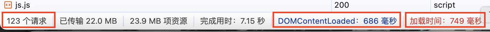
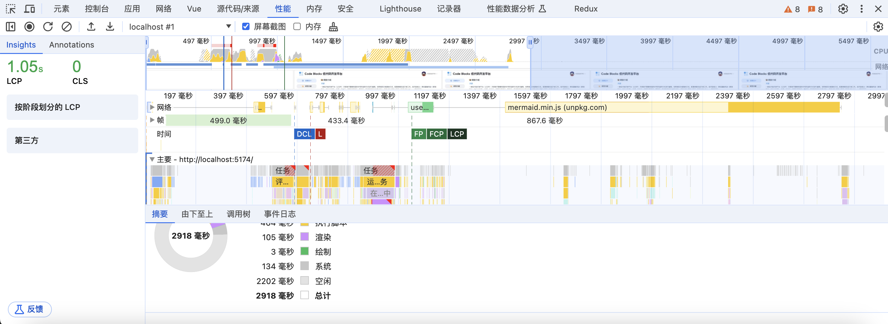
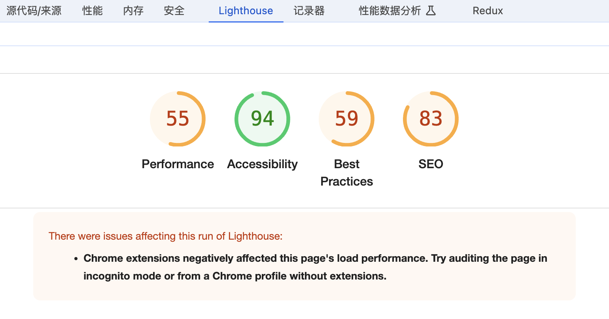

# 性能优化指标

- `First Paint (FP)`：首次绘制时间，指浏览器首次在屏幕上渲染像素的时间，代表页面开始渲染的时间点。
- `First Contentful Paint (FCP)`：首次内容绘制时间，指浏览器首次绘制页面中至少一个文本、图像、非白色背景色的canvas/svg元素等的时间，代表页面首屏加载的时间点。
- `First Meaningful Paint (FMP)`： 首次有意义绘制
- `Last Contentful Paint (LCP)`： 最大内容绘制时间，指页面上最大的可见元素（文本、图像、视频等）绘制完成的时间，代表用户视觉上感知到页面加载完成的时间点。
- `Time to Interactive (TTI）`：用户可交互时间，指页面加载完成并且用户能够与页面进行交互的时间，代表用户可以开始操作页面的时间点。
- `Total Blocking Time (TBT)`：页面总阻塞时间，页面上出现阻塞的时间，指在页面变得完全交互之前，用户与页面上的元素交互时出现阻塞的时间。TBT应该尽可能小，通常应该在300毫秒以内。
- `Search Engine Optimization (SEO)`：搜索引擎优化，网站在搜索引擎中的排名和可见性。评分范围从0到100，100分表示网站符合所有SEO最佳实践。

`FP` 和 `FCP` 上面两个可以通过浏览器提供的 api 来实现 `Performance` api，`FMP` 一般都是 Mutation Observer 监听到 DOM 变化

**可以通过 `network` 、 `performance` 和 `lighthouse` 三个面板来查看页面的性能指标。**

## 在 `network` 面板中，我们可以看到如下几个指标：

- 加载资源数（请求数量）：加载资源数量越少，性能越好
- DOMContnentLoaded：初始化 html 文档被完全加载和解析之后所用的时候（不包含样式、图片和框架的加载时间）
- 加载时间：页面完全加载所用时间

## 在 `performance` 面板中，我们可以看到如下几个指标：

- `FP` : First Paint 首次绘制，用户第一次看到白屏的时间
- `FCP` : First Contentful Paint 首次内容绘制，页面任意元素渲染完成时间
- `LCP` : Largest Contentful Paint 最大内容绘制，页面中最大的元素渲染完成时间

## 在 `lighthouse` 面板中，我们可以页面打分：

