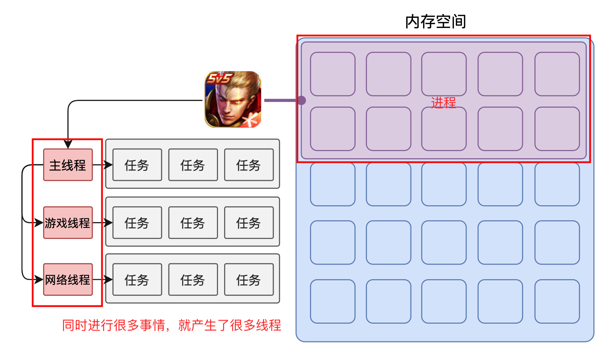
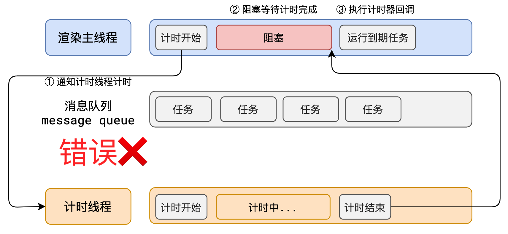

# 事件循环

## 浏览器的进程模型

### 1、何为进程？

程序运行需要有它自己专属的内存空间，这个空间就是进程。

每个应用至少有一个进程，**进程之间相互独立**，即使要通信，也需要双方同意。

### 2、何为线程？

有了进程后，就可以运行程序的代码了。

运行代码的「人」称之为「线程」。

**一个进程 `至少` 有一个线程，所以在进程开启后会自动创建一个线程来运行代码，该线程称之为 `主线程`。**

> 主线程结束，整个程序也就结束了

如果程序需要同时执行多块代码，主线程就会启动更多的线程来执行代码，所以一个进程中可以包含多个线程。



### 3、浏览器有哪些进程和线程？

**浏览器是一个 `多进程多线程` 的应用程序**

为了避免相互影响，为了减少连环崩溃的几率，**当启动浏览器后，它会自动启动 `多个进程`**。


> 可以在浏览器的**任务管理器**中查看当前的所有进程

其中，最主要的进程有：

1. 浏览器进程

   主要负责 `界面显示`(tab标签页、浏览器前进后退、地址栏等)、`用户交互`、`子进程管理`(网络进程、渲染进程等其他进程都是浏览器进程启动的，最开始只有浏览器进程）等。浏览器进程内部会启动多个线程处理不同的任务。

2. 网络进程

   负责加载网络资源。网络进程内部会启动多个线程来处理不同的网络任务。

3. **渲染进程**（`重点`）

   渲染进程启动后，它会开启一个**主线程(也叫渲染主线程)**，主线程负责执行 HTML、CSS、JS 代码。
   
   默认情况下，浏览器会为每个标签页开启一个新的渲染进程，以保证不同的标签页之间不相互影响。

::: tip 注意

**事件循环**发生在**渲染主线程**

:::

## 渲染主线程是如何工作的？

渲染主线程是浏览器中最繁忙的线程，需要它处理的任务包括但不限于：

- 解析 HTML
- 解析 CSS
- 计算样式
- 布局
- 处理图层
- 每秒把页面画 60 次（帧率：1 / 60 = 16.7ms）
- 执行全局 JS 代码
- 执行事件处理函数
- 执行计时器的回调函数
- ......

要处理这么多任务，主线程应该如何调度任务？

答：排队


1. 在最开始的时候，渲染主线程会进入一个无限循环
2. 每一次循环会检查消息队列中是否有任务存在。如果有，就取出第一个任务执行，执行完一个后进入下一次循环；如果没有，则进入休眠状态。
3. 其他所有线程（包括其他进程的线程）可以随时向消息队列添加任务。新任务会加到消息队列的末尾。在添加新任务时，如果主线程是休眠状态，则会将其唤醒以继续循环拿取任务

**整个过程，被称之为事件循环（消息循环）**

## 解释1：何为异步？

代码在执行过程中，会遇到一些无法立即处理的任务，比如：

- 计时完成后需要执行的任务 —— `setTimeout`、`setInterval`
- 网络通信完成后需要执行的任务 -- `XHR`、`Fetch`
- 用户操作后需要执行的任务 -- `addEventListener`

如果让渲染主线程等待这些任务的时机达到，就会导致主线程长期处于**阻塞**的状态，从而导致浏览器**卡死**：

异步代码变为同步，阻塞渲染主进程图：



**渲染主线程承担着极其重要的工作，无论如何都不能阻塞！** 因此，浏览器选择**异步**来解决这个问题：


使用异步的方式，**渲染主线程永不阻塞**

::: tip [面试题：如何理解 JS 的异步？](../js/如何理解%20JS%20的异步？.md)

**参考答案：**

**JS是一门单线程的语言**，这是因为**它运行在浏览器的渲染主线程中**，而渲染主线程只有一个。

而渲染主线程承担着诸多的工作，渲染页面、执行 JS 都在其中运行。

**如果使用同步的方式，就极有可能导致主线程产生阻塞**，从而导致消息队列中的很多其他任务无法得到执行。这样一来，一方面会导致**繁忙的主线程白白的消耗时间，另一方面导致页面无法及时更新，给用户造成卡死现象**。

**所以浏览器采用异步的方式来避免**。具体做法是当某些任务发生时，比如计时器、网络、事件监听，**主线程将任务交给其他线程去处理，自身立即结束任务的执行，转而执行后续代码。当其他线程完成时，将事先传递的回调函数包装成任务，加入到消息队列的末尾排队，等待主线程调度执行**。

在这种异步模式下，浏览器永不阻塞，从而最大限度的保证了单线程的流畅运行。

:::

## 解释2：JS为何会阻碍渲染？

> 因为 js 和 渲染 都在浏览器的渲染主线程上

**例子：**

```html
<!DOCTYPE html>
<html lang="en">
  <head></head>
  <body>
    <h1>Wifi is awesome!</h1>
    <button>change</button>
    <script>
      var h1 = document.querySelector('h1');
      var btn = document.querySelector('button');

      // 死循环指定的时间
      function delay(duration) {
        var start = Date.now();
        while (Date.now() - start < duration) {}
      }

      btn.onclick = function () {
        h1.textContent = 'wifi很帅'; // 会产生一个 绘制 任务，进入任务队列
        console.log(h1.textContent); // 这里的打印可以看到 h1.textContent 的值是 'wifi很帅'
        delay(3000); // 死循环 3s
      };
    </script>
  </body>
</html>
```

**结果：**

当点击按钮后，会等待 3s 后，才修改页面上 h1 的值。

**原因：**

浏览器主线程在渲染时候会将 `btn.onclick` 按钮点击事件放到 `交互线程` 中，当用户点击按钮，会触发事件回调，`h1.textContent` 这个代码，要使 h1 元素内容改变，需要产生 `绘制` 任务，

此时，渲染主线程有：`h1.textContent`、`console.log(h1.textContent)`、`delay(3000)` 这三个任务，而任务队列有：`绘制` 任务，所以渲染主线程会先执行 `绘制` 任务管理器

但是由于 `delay(3000)` 是一个死循环，导致主线程一直处于阻塞状态，从而导致 `绘制` 任务无法得到执行，从而导致页面无法及时更新，给用户造成卡死现象。

## 解释3：任务有优先级吗？

任务没有优先级，在消息队列中先进先出，但`消息队列是有优先级的`

W3C 的解释:
- 每个任务都有一个任务类型，同一个类型的任务必须在一个队列，不同类型的任务可以分属于不同的队列。在一次事件循环中，浏览器可以根据实际情况从不同的队列中取出任务执行。（意思是 `可以有多个任务队列`）
- 浏览器必须准备好一个微队列，微队列中的任务优先所有其他任务执行。（`微队列优先级最高`）
> 随着浏览器的复杂度急剧提升，W3C 不再使用宏队列的说法

在目前 chrome 的实现中，至少包含了下面的队列：

- 延时队列：用于存放计时器到达后的回调任务，优先级 `中`
- 交互队列：用于存放用户操作后产生的事件处理任务，优先级 `高`
- 微队列：用户存放需要最快执行的任务，优先级 `最高`

> 添加任务到微队列的主要方式主要是使用 Promise、MutationObserver

在去任务队列中拿去任务时，会先去 `微队列` 中查看，如果没有就去 `交互队列` 中查看...

**练习1：**

```js
setTimeout(function () {
  console.log(1); // 3、输出1
}, 0);

function delay(duration) {
  var start = Date.now();
  while (Date.now() - start < duration) {}
}
delay(3000); // 1、卡 3s
console.log(2); // 2、输出2
```

**练习2：**

```js
function a() {
  console.log(1);
  Promise.resolve().then(function () {
    console.log(2);
  });
}
setTimeout(function () { // 时间到了后，将该函数放入 延时队列 中
  console.log(3);
}, 0);

Promise.resolve().then(a);

console.log(4);

4 // 全局js
1 // Promise.resolve().then(a); 中调用 'a函数' 放入微任务队列，a中输出1
2 // 微任务队列中，输出2
3 // 延时队列
```

## [面试题1：阐述一下 JS 的事件循环](../js/阐述一下%20JS%20的事件循环.md)

事件循环又叫做消息循环，是浏览器渲染主线程的工作方式。

它开启一个不会结束的 for 循环，每次循环从消息队列中取出第一个任务执行，而其他线程只需要在合适的时候将任务加入到队列末尾即可。

每个任务有不同的类型，同类型的任务必须在同一个队列，不同的任务可以属于不同的队列。不同任务队列有不同的优先级，在一次事件循环中，由浏览器自行决定取哪一个队列的任务。但浏览器必须有一个微队列，微队列的任务一定具有最高的优先级，必须优先调度执行。

## [面试题2：JS 中的计时器能做到精确计时吗？为什么？](../js/JS%20中的计时器能做到精确计时吗？.md)

不行，因为：
1. 操作系统的计时函数本身就有少量偏差，由于 JS 的计时器最终调用的是操作系统的函数，也就携带了这些偏差
2. 受事件循环的影响，计时器的回调函数只能在主线程空闲时运行，因此又带来了偏差