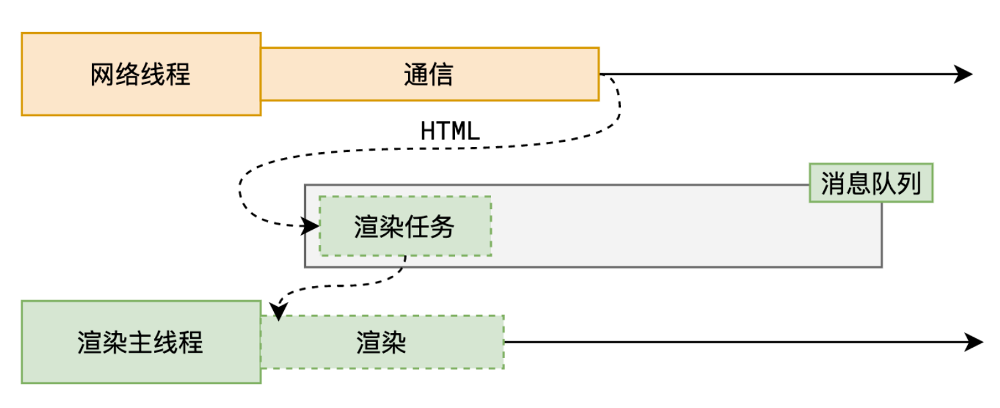
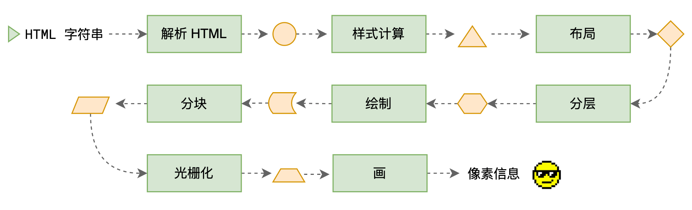
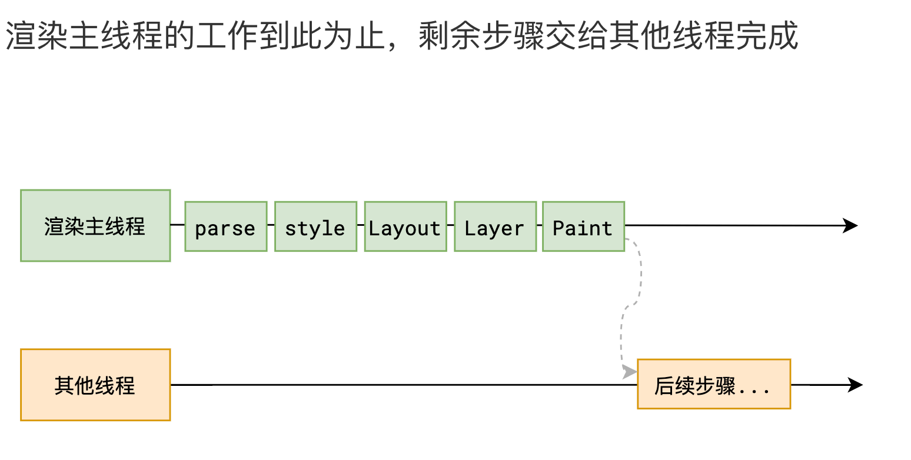

# 浏览器渲染原理

## 什么是渲染

将 html 字符串 转换成 页面像素信息

## 浏览器是如何渲染页面的？

当浏览器的网络线程收到 HTML 文档后，会产生一个渲染任务，并将其传递给渲染主线程的消息队列。

在事件循环机制的作用下（不断从任务队列拿任务），渲染主线程取出消息队列中的渲染任务，开启渲染流程。

## 渲染流水线

整个渲染流程分为多个阶段，分别是： HTML 解析、样式计算、布局、分层、绘制、分块、光栅化、画

每个阶段都有明确的输入输出，上一个阶段的输出会成为下一个阶段的输入。

这样，整个渲染流程就形成了一套组织严密的生产流水线。

## 第一步 解析 HTML

HTML 解析器会按照一定的规则，将 HTML 文档解析为 DOM 树 和 CSSOM 树。

解析过程中遇到 CSS 解析 CSS，遇到 JS 执行 JS。为了提高解析效率，浏览器在开始解析前，会启动一个 `预解析的线程`，率先下载 HTML 中的外部 CSS 文件和 外部的 JS 文件。

如果主线程解析到`link`位置，此时外部的 CSS 文件还没有下载解析好，主线程不会等待，继续解析后续的 HTML。这是因为下载和解析 CSS 的工作是在预解析线程中进行的。这就是 `CSS 不会阻塞 HTML 解析` 的**根本原因**。

如果主线程解析到`script`位置，`会停止解析 HTML`，转而等待 JS 文件下载好，并将全局代码解析执行完成后，才能继续解析 HTML。这是因为 JS 代码的执行过程可能会修改当前的 DOM 树，所以 DOM 树的生成必须暂停。这就是 **JS 会阻塞 HTML 解析的根本原因**。

第一步完成后，会得到 DOM 树和 CSSOM 树，浏览器的默认样式、内部样式、外部样式、行内样式均会包含在 CSSOM 树中。

## 第二步 样式计算

主线程会遍历得到的 DOM 树，依次为树中的每个节点计算出它最终的样式，称之为 Computed Style。

在这一过程中，很多预设值会变成绝对值，比如`red`会变成`rgb(255,0,0)`；相对单位会变成绝对单位，比如`em`会变成`px`

这一步完成后，会得到一棵带有样式的 DOM 树。

## 第三步 布局

布局阶段会依次遍历 DOM 树的每一个节点，计算每个节点的几何信息。例如节点的宽高、相对包含块的位置。

大部分时候，DOM 树和布局树并非一一对应。

比如`display:none`的节点没有几何信息，因此不会生成到布局树；又比如使用了伪元素选择器，虽然 DOM 树中不存在这些伪元素节点，但它们拥有几何信息，所以会生成到布局树中。还有匿名行盒、匿名块盒等等都会导致 DOM 树和布局树无法一一对应。

## 第四步 分层

主线程会使用一套复杂的策略对整个布局树中进行分层。

分层的好处在于，将来某一个层改变后，仅会对该层进行后续处理，从而提升效率。

滚动条、堆叠上下文、transform、opacity 等样式都会或多或少的影响分层结果，也可以通过`will-change`属性更大程度的影响分层结果。

## 第五步 绘制

主线程会为每个层单独产生绘制指令集，用于描述这一层的内容该如何画出来。

`完成绘制后，主线程将每个图层的绘制信息提交给合成线程，剩余工作将由合成线程完成。`

## 第六步 分块

合成线程首先对每个图层进行分块，将其划分为更多的小区域。

它会从线程池中拿取多个线程来完成分块工作，可以同时进行。

## 第七步 光栅化

合成线程会将块信息交给 GPU 进程，以极高的速度完成光栅化。

GPU 进程会开启多个线程来完成光栅化，并且优先处理靠近视口区域的块。

**光栅化的结果，就是一块一块的位图（像素块）**

## 第八步 画

合成线程拿到每个层、每个块的位图后，生成一个个「指引（quad）」信息。

指引会标识出每个位图应该画到屏幕的哪个位置，以及会考虑到旋转、缩放等变形。

`变形发生在合成线程，与渲染主线程无关`，这就是`transform`效率高的本质原因。

合成线程会把 quad 提交给 GPU 进程，由 GPU 进程产生系统调用，提交给 GPU 硬件，完成最终的屏幕成像。

## 面试题 1：什么是 reflow？

reflow(回流) 的本质就是重新计算 layout（布局） 树，重新排版。

当进行了会影响布局树的操作后，需要重新计算布局树，会引发 layout。

为了避免连续的多次操作导致布局树反复计算，浏览器会合并这些操作，当 JS 代码全部完成后再进行统一计算。所以，改动属性造成的 reflow 是异步完成的。

也同样因为如此，当 JS 获取布局属性时，就可能造成无法获取到最新的布局信息。

浏览器在反复权衡下，最终决定获取属性立即 reflow。

## 面试题 2：如何避免 reflow(回流)？

避免reflow（回流）是提高网页性能的一个重要方面，因为reflow会消耗大量资源，尤其是在复杂的页面中。以下是一些避免或减少reflow的策略：

- 减少DOM操作：尽量减少对DOM的读写操作，可以将多次操作合并为一次。
- 批量修改样式：使用class来修改元素样式，而不是频繁地直接修改style属性。
- 避免设置内联样式：尽量通过CSS类来控制样式，而不是使用JavaScript直接设置内联样式。
- 使用getComputedStyle或currentStyle：如果需要获取样式信息，可以先获取所有计算后的样式，减少对DOM的访问次数。
- 固定布局尺寸：对于不改变大小的元素，明确指定其宽度和高度，浏览器可以更容易确定其他元素的位置。
- 减少不必要的复杂结构：简化HTML结构，避免过多嵌套，这有助于减少reflow的影响范围。

## 面试题 3：什么是 repaint？

repaint（重绘） 的本质就是重新根据分层信息计算了绘制指令。

当改动了可见样式后，就需要重新计算，会引发 repaint。

由于元素的布局信息也属于可见样式，`所以 reflow 一定会引起 repaint`。

## 面试题 4：如何避免 repaint(重绘)？

- 减少样式更改：尽量减少对元素样式的频繁更改，特别是那些不影响布局但影响外观的属性（如颜色、背景等）。
- 批量更新样式：将多个样式更改合并为一次操作，使用class来切换样式，而不是逐个修改样式属性。
- 使用CSS动画：对于动画效果，优先使用CSS动画和过渡效果，而不是通过JavaScript频繁修改样式。
- 离屏渲染：利用will-change属性提示浏览器提前准备可能的动画或变化，从而减少实际发生时的重绘。
- 避免使用昂贵的样式属性：某些CSS属性（如box-shadow、border-radius、opacity等）会触发更频繁的重绘，应谨慎使用。
- 固定位置元素：对于固定位置的元素（如浮动菜单），确保它们不会因为其他元素的变化而频繁重绘。
- 使用GPU加速：将一些复杂的动画或变换交给GPU处理，例如使用translate3d或transform: translateZ(0)来触发硬件加速。
- 减少透明度和滤镜效果：这些效果会导致更多的重绘，应尽量减少使用。

# 面试题 5：为什么 transform 的效率高？

因为 transform 既不会影响布局也不会影响绘制指令，它影响的只是渲染流程的最后一个 `draw` 阶段

由于 draw 阶段在合成线程中，所以 transform 的变化几乎不会影响渲染主线程。反之，渲染主线程无论如何忙碌，也不会影响 transform 的变化。